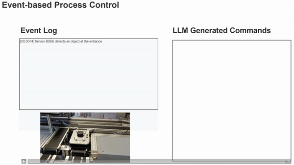
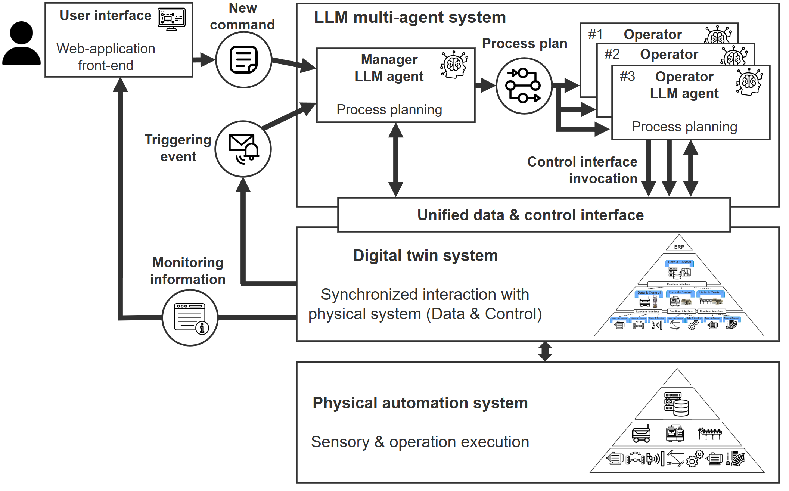
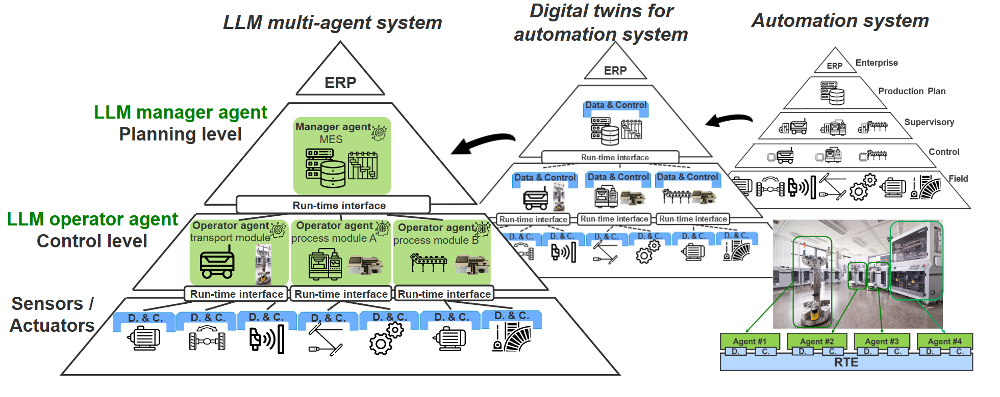
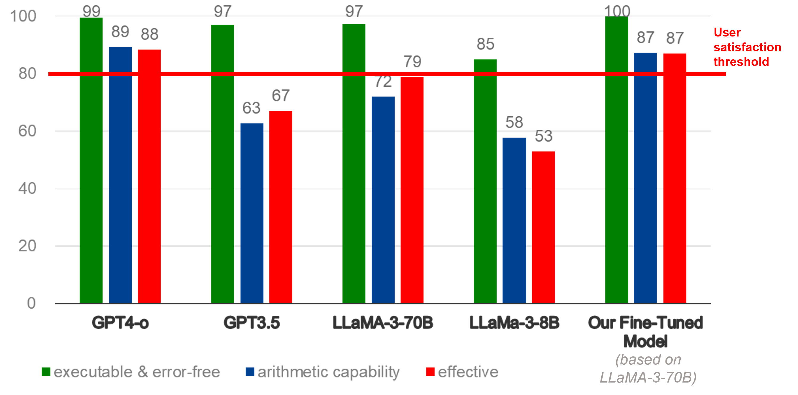

# GPT4IndustrialAutomation 

This repository contains the demos of the paper "**Towards an Autonomous System: A Flexible Modular Production System Enhanced with Large Language Model Agents.**" and "**Incorporating Large Language Models into Production Systems for Enhanced Task Automation and Flexibility**"

> :mortar_board::page_facing_up: The peer-reviewed version of this paper has been published by IEEE after the conference **IEEE-ETFA2023** (The 28th Annual Conference of the IEEE Industrial Electronics Society (IES) - The International Conference on Emerging Technologies and Factory Automation) (in Track - Artificial Intelligence for Cyber-Physical Systems in Automation), which took place on September 12th to 15th, 2023. Paper: **Towards autonomous system: flexible modular production system enhanced with large language model agents**
> 
> **Final Published Version after Peer-Review**(https://ieeexplore.ieee.org/document/10275362),
> 
> **Pre-print**: [On Arxiv: https://arxiv.org/abs/2304.14721](https://arxiv.org/abs/2304.14721)

-

> :mortar_board::page_facing_up: Another paper with **more design details** has been presented in German VDI Automation Kongress, in Proceedings of the VDI-Berichte Nr. 2437, 2024. The conference took place on July 02nd to 03rd, 2024. Paper: **Incorporating Large Language Models into Production Systems for Enhanced Task Automation and Flexibility** (https://arxiv.org/abs/2407.08550).
> 
> Insight: Fine-tuned Model based on Llama-3-70B has equal performance with GPT4.
 
# :movie_camera: Demo Videos:


# :clapper: The Prompting Design:


# :clapper: Event-based control via function call:


More details about this event-based control mechanism can be found in Paper: **Incorporating Large Language Models into Production Systems for Enhanced Task Automation and Flexibility** (https://arxiv.org/abs/2407.08550). 

# The system overview:


# The big picture:


# Fine-tuned Model based on Llama-3-70B has equal performance with GPT4:


More details about the fine-tuning: **Incorporating Large Language Models into Production Systems for Enhanced Task Automation and Flexibility** (https://arxiv.org/abs/2407.08550)


# Paper Citation
If you find the approach presented interesting and some of the ideas inspiring, please consider citing our work. We will be very glad to receive **your applause with a citation**, which will signal to us that there is true interest and demand.

>Y. Xia, M. Shenoy, N. Jazdi and M. Weyrich, "Towards autonomous system: flexible modular production system enhanced with large language model agents," 2023 IEEE 28th International Conference on Emerging Technologies and Factory Automation (ETFA), Sinaia, Romania, 2023, pp. 1-8, doi: 10.1109/ETFA54631.2023.10275362.

```bibtex
@INPROCEEDINGS{10275362,
  author={Xia, Yuchen and Shenoy, Manthan and Jazdi, Nasser and Weyrich, Michael},
  booktitle={2023 IEEE 28th International Conference on Emerging Technologies and Factory Automation (ETFA)}, 
  title={Towards autonomous system: flexible modular production system enhanced with large language model agents}, 
  year={2023},
  volume={},
  number={},
  pages={1-8},
  doi={10.1109/ETFA54631.2023.10275362}}
```
```
@article{Xia2024,
   author = {Yuchen Xia and Jize Zhang and Nasser Jazdi and Michael Weyrich},
   year = {2024},
   month = {7},
   publisher = {VDI Verlag},
   title = {Incorporating Large Language Models into Production Systems for Enhanced Task Automation and Flexibility},
   url = {http://arxiv.org/abs/2407.08550},
   doi = {10.48550/arXiv.2407.08550}
}
```


# Core Beliefs and Values as a Researcher
I conduct research activities in science and engineering inspired by the principles of **optimistic humanism** and **entrepreneurship**.
