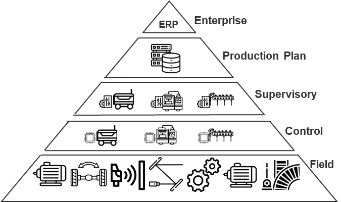

# GPT4IndustrialAutomation 

This repository contains the demos of the paper "**Towards an Autonomous System: A Flexible Modular Production System Enhanced with Large Language Model Agents.**"

> :mortar_board::page_facing_up: The peer-reviewed version of this paper has been published by IEEE after the conference **IEEE-ETFA2023** (The 28th Annual Conference of the IEEE Industrial Electronics Society (IES) - The International Conference on Emerging Technologies and Factory Automation) (in Track - Artificial Intelligence for Cyber-Physical Systems in Automation), which took place on September 12th to 15th, 2023. Paper: Towards autonomous system: flexible modular production system enhanced with large language model agents (https://ieeexplore.ieee.org/document/10275362)
>
> 
# :movie_camera: Demo Videos:


# :clapper: The Prompting Design:


# The system overview:


# The big picture:



# The Paper: 
## Pre-Print Drafts
You can find the original **pre-print draft** of the manuscript at the following links, which were for early public discussion within the research community before the final version and the copyright transfer.

**Towards autonomous system: flexible modular production system enhanced with large language model agents (pre-print)**
- [On ResearchGate: https://www.researchgate.net](https://www.researchgate.net/publication/370417635_Towards_autonomous_system_flexible_modular_production_system_enhanced_with_large_language_model_agents)
- [On Arxiv: https://arxiv.org/abs/2304.14721](https://arxiv.org/abs/2304.14721)

## Final Published Version after Peer-Review
You can find the final published version at **IEEE Xplore** listed under the International Conference on Emerging Technologies and Factory Automation (IEEE-ETFA):
- [**Towards autonomous system: flexible modular production system enhanced with large language model agents (https://ieeexplore.ieee.org/document/10275362)**](https://ieeexplore.ieee.org/document/10275362)
> :copyright: The final version is exclusively published by IEEE according to the copyright agreement. We've made a few improvements to the final version of the paper based on valuable feedback and suggestions from other researchers during the peer-review.

## Paper Citation
If you find the approach presented interesting and some of the ideas inspiring, please consider citing our work. We will be very glad to receive **your applause with a citation**, which will signal to us that there is true interest and demand. Your acknowledgement will **motivate us** to dedicate greater effort, humbly trying **to discover** more value in an uncertain and unknown world of science, and share our discoveries with the academic and industry communities. 

>Y. Xia, M. Shenoy, N. Jazdi and M. Weyrich, "Towards autonomous system: flexible modular production system enhanced with large language model agents," 2023 IEEE 28th International Conference on Emerging Technologies and Factory Automation (ETFA), Sinaia, Romania, 2023, pp. 1-8, doi: 10.1109/ETFA54631.2023.10275362.

```bibtex
@INPROCEEDINGS{10275362,
  author={Xia, Yuchen and Shenoy, Manthan and Jazdi, Nasser and Weyrich, Michael},
  booktitle={2023 IEEE 28th International Conference on Emerging Technologies and Factory Automation (ETFA)}, 
  title={Towards autonomous system: flexible modular production system enhanced with large language model agents}, 
  year={2023},
  volume={},
  number={},
  pages={1-8},
  doi={10.1109/ETFA54631.2023.10275362}}
```

# Core Beliefs and Values as a Researcher
I conduct research activities in science and engineering inspired by the principles of **optimistic humanism** and **entrepreneurship**.
